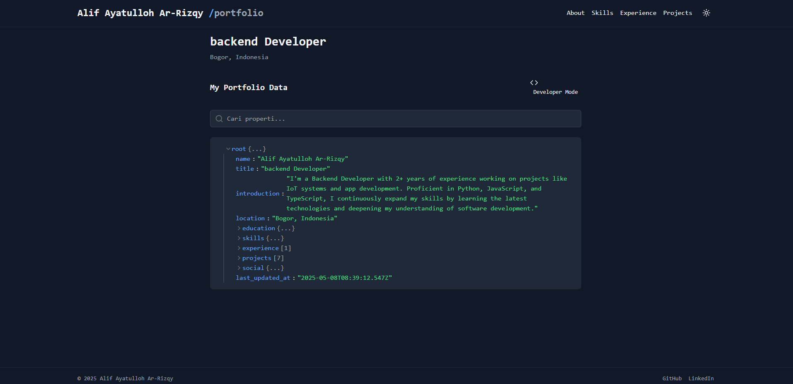

# Backend Portfolio

A modern, minimalist portfolio site built with React that displays resume data in a beautiful JSON viewer interface.



## 🌟 Features

- Interactive JSON-based resume display
- Developer mode for raw JSON viewing
- Copy resume data with a single click
- Dark/Light mode support
- Responsive design that works on all devices
- Search functionality to quickly find specific details
- Live timestamp updates in Jakarta timezone

## 🛠️ Tech Stack

- **Frontend**: React, JavaScript
- **Styling**: Tailwind CSS
- **Data Handling**: Custom hooks for live updates

## 🚀 Getting Started

### Prerequisites

- Node.js (v14+)
- npm or yarn

### Installation

1. Clone the repository:

   ```bash
   git clone https://github.com/alif-arrizqy/backend-portfolio.git
   cd backend-portfolio
   ```

2. Install dependencies:

   ```bash
   npm install
   ```

3. Start the development server:

   ```bash
   npm run start
   ```

4. Open your browser and navigate to `http://localhost:5173`

## 📦 Building for Production

To create a production build:

```bash
npm run build
```

Running the production build:

```bash
npm run start
```

## 📂 Project Structure

```
backend-portfolio/
├── public/
│   ├── favicon.ico
│   ├── robots.txt
│   └── index.html
├── src/
│   ├── components/
│   │   ├── layout/
│   │   │   ├── Header.jsx
│   │   │   ├── Footer.jsx
│   │   │   └── Layout.jsx
│   │   ├── ui/
│   │   │   ├── Button.jsx
│   │   │   ├── SearchBar.jsx
│   │   │   └── ThemeToggle.jsx
│   │   ├── portfolio/
│   │   │   ├── JSONNode.jsx
│   │   │   ├── PortfolioViewer.jsx
│   │   │   └── DevModeToggle.jsx
│   │   └── index.js
│   ├── data/
│   │   └── portfolioData.js
│   ├── hooks/
│   │   ├── useTheme.js
│   │   └── useLiveUpdate.js
│   ├── styles/
│   │   └── globals.css
│   ├── utils/
│   │   └── formatters.js
│   ├── App.jsx
│   └── index.js
├── .gitignore
├── package.json
├── tailwind.config.js
└── README.md
```

## 🧪 Customization

To use this for your own portfolio:

1. Edit the `src/data/portfolioData.js` file with your information
2. Customize colors and styling in the components
3. Update metadata and favicon in the public directory

## 🔧 Key Features Explanation

### JSON Viewer
The portfolio displays your resume data in an interactive JSON format that allows users to collapse and expand sections.

### Dev Mode
Toggle between a user-friendly view and raw JSON display for developers.

### Live Updates
The portfolio shows when the data was last updated with accurate Jakarta timezone.

### Search Functionality
Quickly find specific information within your extensive portfolio data.

## 👤 Author

- **Alif Ayatulloh Arrizqy** - [alif-arrizqy](https://github.com/alif-arrizqy)
```

This README provides a comprehensive overview of your project, including features, tech stack, setup instructions, and customization guidance. Feel free to adjust any details to better match your specific implementation!

Enjoy code! ☕